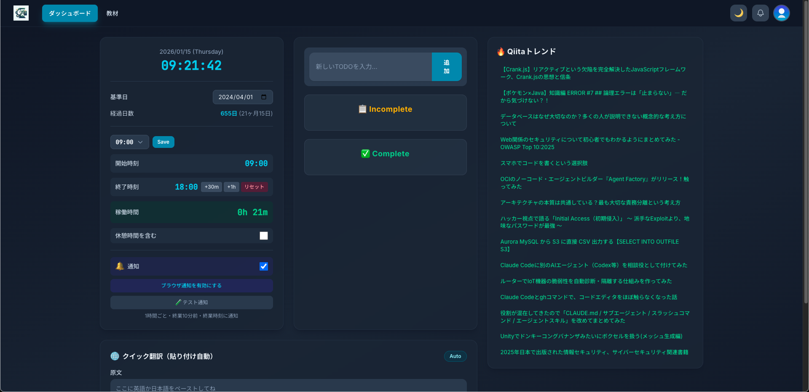
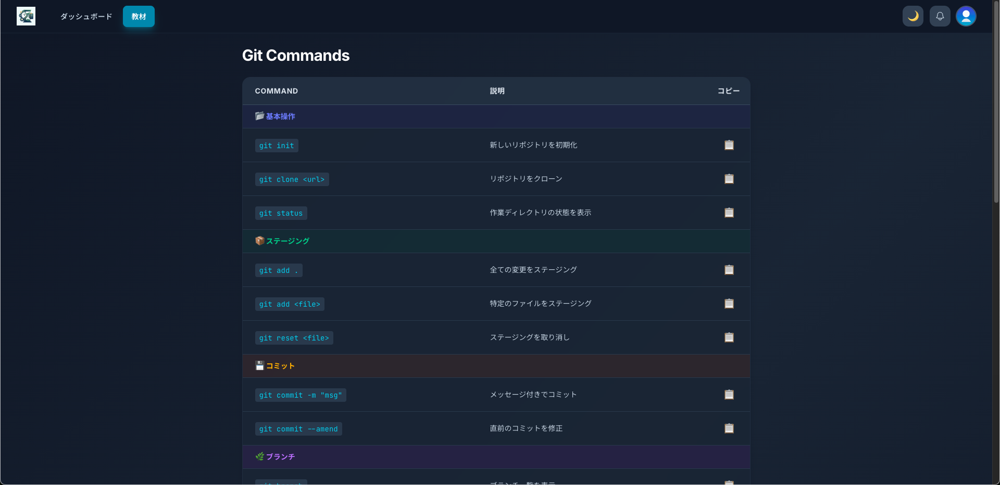

# Science App 📊

時間管理、タスク管理、そして学習支援を一元化する開発者向けのWebアプリケーションです。

## 概要

Science Appは、日々の作業効率を最大化するために開発されたRailsアプリケーションです。
リアルタイムな進捗確認が可能なダッシュボード、素早い情報収集を支える翻訳機能、そして迷わず作業に戻れる学習教材を提供します。

## 主な機能


### 🏠 ダッシュボード

- **時間管理システム**:
  - **リアルタイムクロック**: 日本標準時を表示。
  - **稼働時間追跡**: 開始・終了予定時刻の入力により、現在の稼働時間を自動計算。
  - **基準日カウント**: 指定した日付からの経過日数を表示し、プロジェクトの期間を可視化。
- **スマートTODOリスト**: ドラッグ＆ドロップ不要のシンプルなタスク管理。完了済みタスクと未完了タスクを整理して表示。
- **クイック翻訳**: DeepL APIと連携し、テキスト入力やペースト時に即座に日英・英日翻訳を実行。
- **ブラウザ通知**: 1時間ごとのリマインダーや、終業時刻に合わせた通知をブラウザ経由で送信。
- **Qiitaトレンド**: 開発者のための最新技術トレンドをリアルタイムでリストアップ。

### 📚 学習教材

- **Gitコマンド集**: 頻用するGitコマンドを、ボタン一つでコピー可能な形式で提供。
- **チートシート**: プログラミング学習や開発時に役立つ各種リファレンス。

### 🌓 その他
- **ダークモード対応**: OSの設定やユーザーの好みに合わせてライト/ダークテーマを切り替え可能。
- **認証システム**: 安全なAPI/セッション管理によるユーザーごとのデータ保存。

## 技術スタック

- **Backend**: Ruby on Rails 8.1.1 (Ruby 3.x)
- **Database**: PostgreSQL
- **Frontend**: 
  - **CSS**: Tailwind CSS
  - **JS**: Stimulus, Hotwire/Turbo (Propshaft によるアセット管理)
- **External APIs**: 
  - DeepL API (テキスト翻訳)
  - Qiita RSS (トレンド情報)
- **Deployment**: Kamal, Docker
- **Testing**: RSpec, Capybara, Selenium

## セットアップ

### 必要要件
- Ruby 3.x 以上
- PostgreSQL 
- DeepL APIキー (翻訳機能を使用する場合)

### インストール手順

```bash
# リポジトリのクローン
git clone [repository-url]
cd science-app
# 依存関係のインストール
bundle install

# データベースの作成と初期化
rails db:create
rails db:migrate
rails db:seed

# Tailwind CSSのビルド
rails tailwindcss:build

# 開発サーバーの起動
bin/dev
```

## データベース構成

- `users`: ユーザー認証情報
- `sessions`: アクティブなセッション管理
- `todos`: ユーザーごとのタスクデータ
